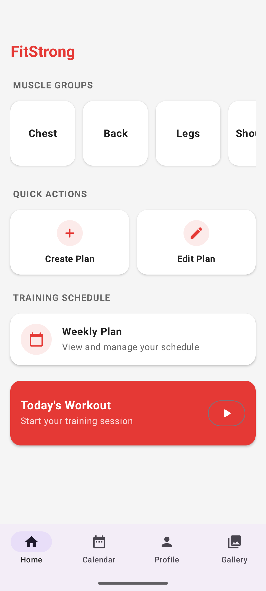
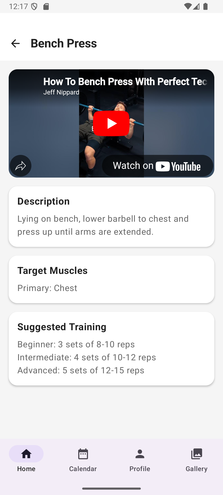

# TrainingApp - Aplikacja do Planowania Treningów

## Opis Aplikacji

TrainingApp to aplikacja mobilna na Android napisana w Kotlin z wykorzystaniem Jetpack Compose, która umożliwia planowanie i śledzenie treningów siłowych. Aplikacja pozwala na tworzenie spersonalizowanych planów treningowych, przeglądanie bazy ćwiczeń oraz monitorowanie postępów.

## 📱 Screenshots

 
 

<table>
 <tr>
   <td align="center">
      
     <b>Dashboard główny</b> 
     <i>Przegląd grup mięśniowych i szybkie akcje</i>
   </td>
   <td align="center">
      
     <b>Szczegóły ćwiczenia</b> 
     <i>Instrukcje z filmem YouTube</i>
   </td>
 </tr>
</table>

## Główne Funkcjonalności

- **Dashboard treningowy** - przegląd grup mięśniowych i szybkie akcje
- **Baza ćwiczeń** - katalog ćwiczeń z opisami i filmami instruktażowymi z YouTube
- **Tworzenie planów treningowych** - kreator planów z wyborem dni i ćwiczeń
- **Kalendarz treningowy** - harmonogram tygodniowy z zaplanowanymi sesjami
- **Sesje treningowe** - prowadzenie aktywnych treningów z listą kontrolną
- **Profil użytkownika** - dane osobowe, cele fitness, BMI
- **Galeria** - kolekcja zdjęć motywacyjnych
- **Statystyki** - śledzenie postępów i historii treningów

## Architektura Aplikacji

Aplikacja wykorzystuje architekturę **MVVM (Model-View-ViewModel)** z następującymi warstwami:

### Model (Warstwa Danych)
- **Room Database** - lokalna baza danych SQLite
- **Entities** - encje bazy danych (WorkoutPlan, Exercise, BodyPart, itp.)
- **DAOs** - interfejsy dostępu do danych
- **Repositories** - warstwa abstrakcji dla źródeł danych

### View (Warstwa UI)
- **Jetpack Compose** - deklaratywny UI toolkit
- **Navigation Component** - nawigacja między ekranami
- **Material Design 3** - system designu

### ViewModel
- **ViewModels** - zarządzanie stanem UI i logiką biznesową
- **StateFlow/LiveData** - reaktywne zarządzanie danymi

## Struktura Pakietów
com.example.trainingapp/
├── data/                    # Warstwa danych
│   ├── dao/                # Data Access Objects
│   ├── database/           # Konfiguracja Room
│   ├── entity/             # Encje bazy danych
│   └── repository/         # Repozytoria
├── navigation/             # Nawigacja aplikacji
├── screens/               # Ekrany UI
│   ├── calendar/          # Kalendarz treningowy
│   ├── dashboard/         # Dashboard główny
│   ├── exercise/          # Baza ćwiczeń
│   ├── gallery/           # Galeria zdjęć
│   ├── plan/              # Tworzenie planów
│   ├── profile/           # Profil użytkownika
│   └── workout/           # Sesje treningowe
├── ui/theme/              # Motyw aplikacji
├── util/                  # Klasy pomocnicze
└── viewmodels/            # ViewModels

## Wykorzystane Biblioteki

### Core Android
- **Jetpack Compose** - nowoczesny toolkit UI
- **Navigation Compose** - nawigacja w Compose
- **Lifecycle ViewModel** - zarządzanie cyklem życia
- **Material 3** - komponenty Material Design

### Baza Danych
- **Room** - ORM dla SQLite
- **Room Compiler** (kapt) - generowanie kodu Room

### Obrazy i Multimedia
- **Coil Compose** - ładowanie obrazów z URL
- **WebView** - wyświetlanie filmów YouTube

### Serializacja
- **Gson** - serializacja/deserializacja JSON

### Ikony
- **Material Icons Extended** - rozszerzony zestaw ikon

### Architektura
- **Kotlin Coroutines** - programowanie asynchroniczne
- **StateFlow/LiveData** - reaktywne strumienie danych

## Kluczowe Funkcje Techniczne

### Baza Danych
- **7 głównych tabel** z relacjami foreign key
- **Predefiniowana baza ćwiczeń** ładowana przy pierwszym uruchomieniu
- **Obsługa planów treningowych** z mapowaniem ćwiczeń na dni

### UI/UX
- **Material Design 3** z czerwonym motywem sportowym
- **Bottom Navigation** z 4 głównymi sekcjami
- **Responsive design** adaptujący się do różnych ekranów
- **WebView integration** dla filmów instruktażowych

### Zarządzanie Stanem
- **SharedPreferences** dla danych użytkownika
- **In-memory state** dla sesji treningowych
- **LiveData observers** dla reaktywności UI